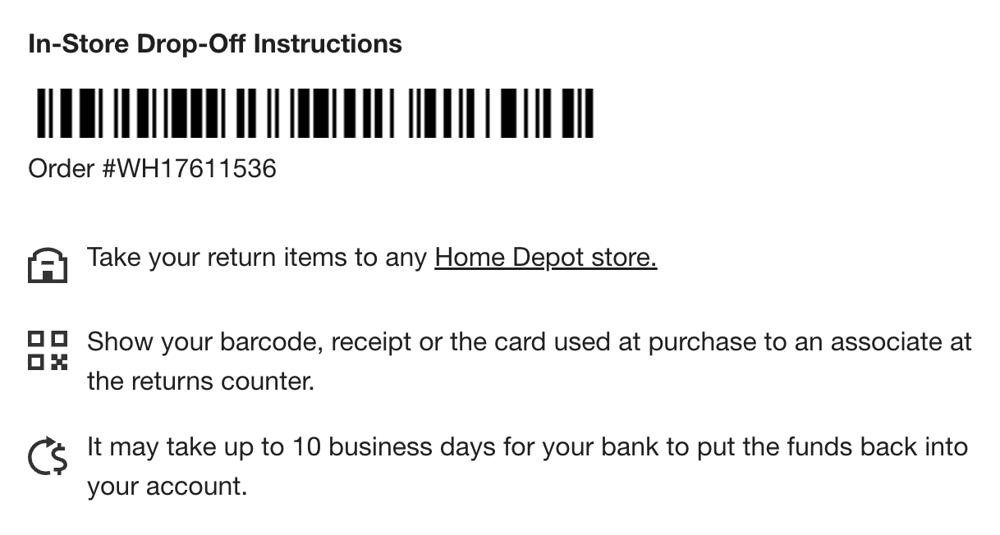

Leave by 5:30 pm

## Directions

🗺️ Full directions: https://maps.app.goo.gl/FV53VnUvz8ey6fGy6

1. 🛒 _[6pm]_ [Publix Super Market at Bradley Park Square, 1639 Bradley Park Dr Ste 600, Columbus, GA 31904](https://maps.app.goo.gl/FoSLTYhvPK9RZTE96)
    - Between 5pm-6pm. https://inst.cr/t/3111e7670
    - Cooler in the trunk has ice packs for all of the cold stuff
1. 🚰 _[6:15pm]_ [The Home Depot, 2891 Sowega Dr, Columbus, GA 31909](https://maps.app.goo.gl/Ed3g21buFJH6qdsc8)
    - Start by getting a table cart, [one like this](https://www.reddit.com/r/HomeDepot/comments/vloa9a/what_is_this_cart_called/)
    - Pull it over to the car, and get the sink on top of it. You should be able to simply _slide_ the sink, not lift it.
    - Go inside to the Customer Service Desk, and show them this code:
    
1. 🧈🐓 _[6:30pm]_ [Jhoomar Indian Cuisine, 2603 Manchester Expy, Columbus, GA 31904](https://maps.app.goo.gl/7svoJVsSMfdaBN176)
    - Pickup is for "Alexander Mann"/`mannimal09@gmail.com`
1. 🏡 _[~7pm]_ [2313 Lower Blue Springs Rd, Hamilton, GA 31811](https://maps.app.goo.gl/wi2G4fu5BKvc1PNW9)